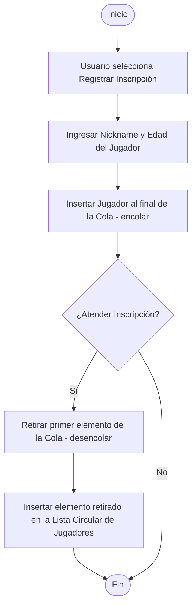
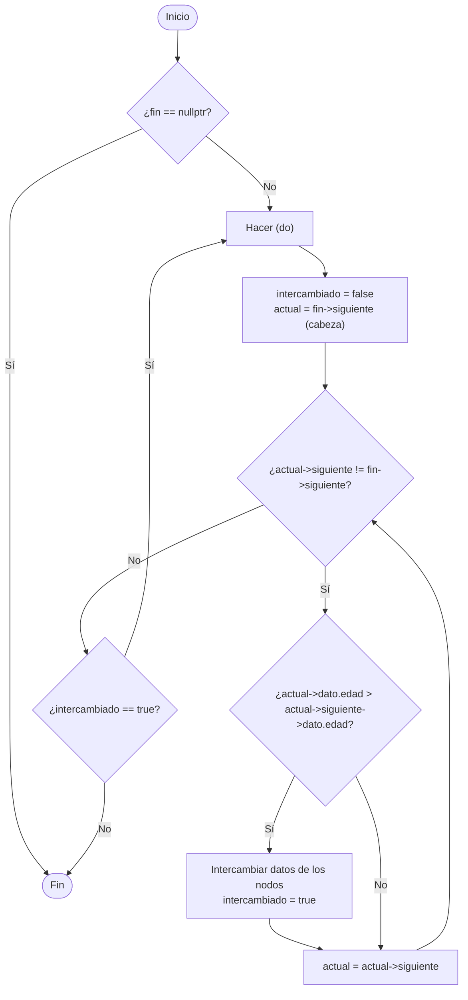
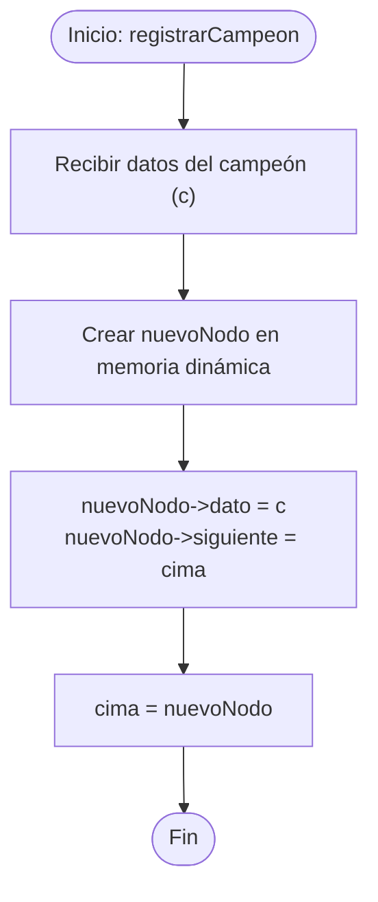
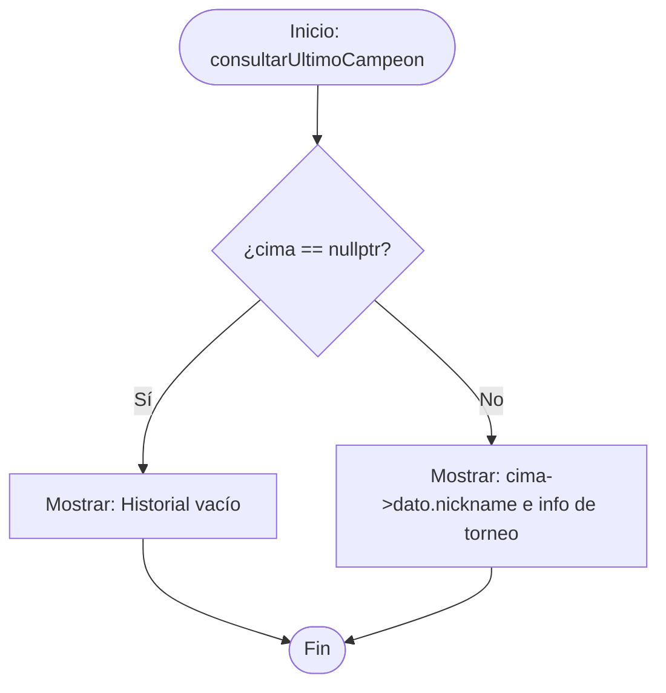

# 📊 Diagramas de Flujo del Sistema

Este documento contiene los diagramas de flujo de los algoritmos y procesos clave del sistema de gestión de torneos.

---

## 1. Proceso de Inscripción y Admisión (Módulo 3)
Describe cómo ingresa un jugador a la cola de espera y cómo es atendido para pasar a formar parte de la lista oficial de competidores del torneo.

## 2. Ordenamiento por Burbuja (Bubble Sort) sobre Lista Circular (Módulo 6)
Diagrama de la implementación de `ordenarPorEdadBurbuja` que recorre la lista circular comparando elementos adyacentes hasta dar la vuelta y retornar si no hay más intercambios.

---

## 3. Registro e Historial de Campeones en Pila LIFO (Módulo 4)
Diagrama de flujo que ilustra el registro de un nuevo campeón (apilar - push) y la consulta del campeón más reciente en el torneo (cima - top).

### Registrar nuevo campeón (Push)

### Consultar último campeón (Top)

