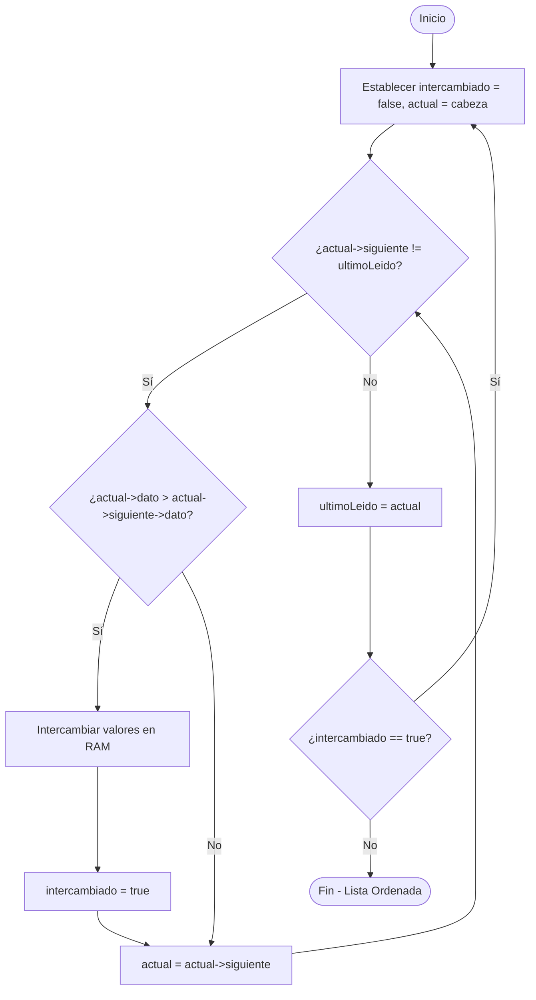
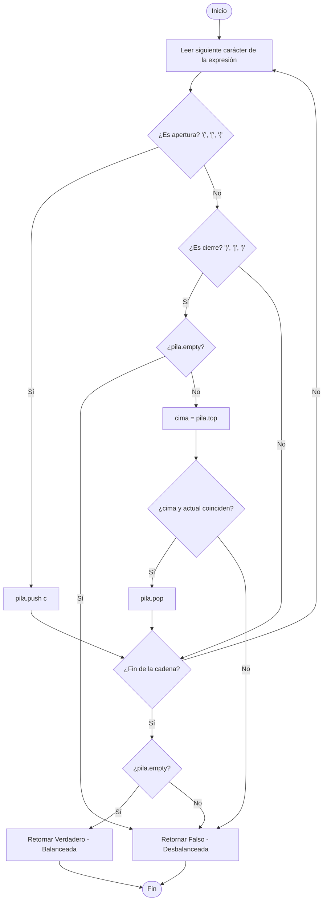

# 📊 Diagramas de Flujo del Sistema

Este documento contiene los diagramas de flujo de los algoritmos y procesos clave del sistema de gestión de torneos.

---

## 1. Proceso de Inscripción y Admisión (Módulo 3)
Describe cómo ingresa un jugador a la cola de espera y cómo es atendido para pasar a formar parte de la lista oficial de competidores del torneo.

---

## 2. Ordenamiento por Burbuja (Bubble Sort) sobre Lista Enlazada
Diagrama del algoritmo para ordenar la lista intercambiando los campos de datos de los nodos.

---

## 3. Algoritmo de Verificación de Expresión Balanceada (Pilas)
Muestra la lógica utilizada para evaluar si los delimitadores matemáticos de agrupación abren y cierran en el orden correcto.

