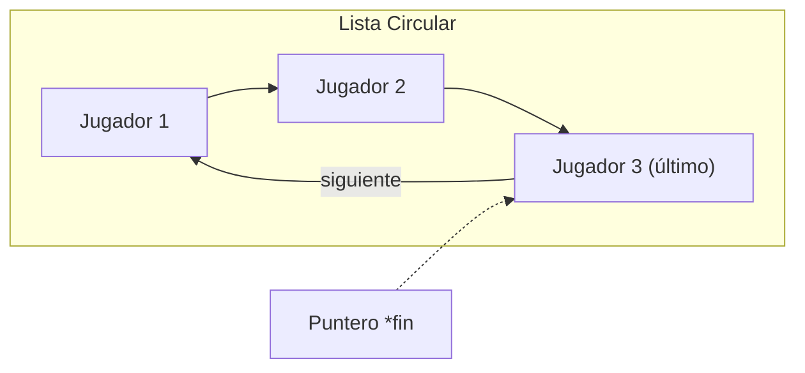
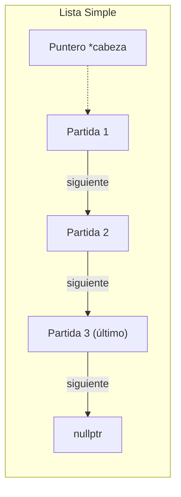
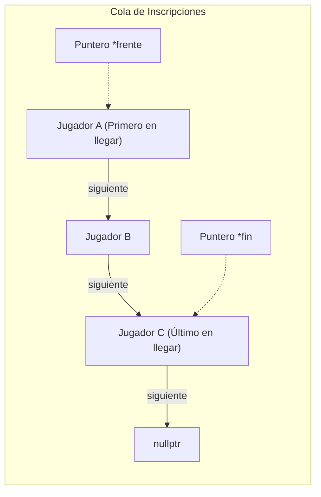
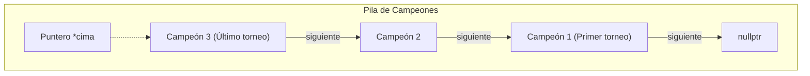

# 🔗 Diagramas de Nodos del Sistema

Este documento describe de forma gráfica cómo se estructuran los nodos y punteros en la memoria RAM para cada una de las 4 estructuras de datos personalizadas implementadas en el proyecto.

---

## 1. Módulo 1: Lista Circular Simple (Gestión de Jugadores)
La lista circular no apunta a `nullptr` al final. En su lugar, el último nodo apunta de vuelta al primer nodo de la lista. Se utiliza un puntero `fin` (al último elemento) para tener acceso en $O(1)$ tanto al inicio como al final.

---

## 2. Módulo 2: Lista Enlazada Simple (Gestión de Partidas)
Cada nodo contiene la información de un enfrentamiento y un puntero único que apunta al siguiente elemento. El último nodo de la lista apunta a `nullptr`.

---

## 3. Módulo 3: Cola FIFO (Inscripciones)
Una cola lineal para el registro ordenado. Los elementos entran por el extremo posterior (`fin`) y se retiran/atienden por el extremo anterior (`frente`).

---

## 4. Módulo 4: Pila LIFO (Historial de Campeones)
El historial se guarda de manera que el último campeón registrado sea el primero en mostrarse. La inserción y eliminación ocurren únicamente sobre el puntero `cima`.

